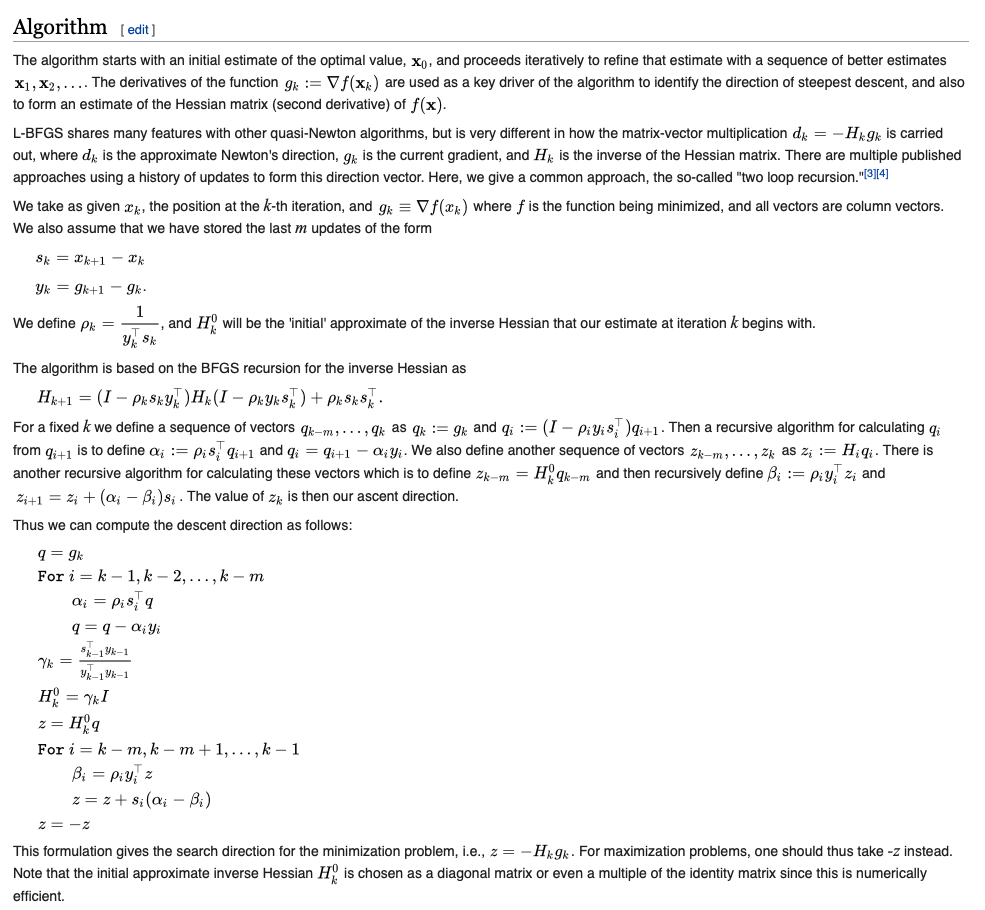
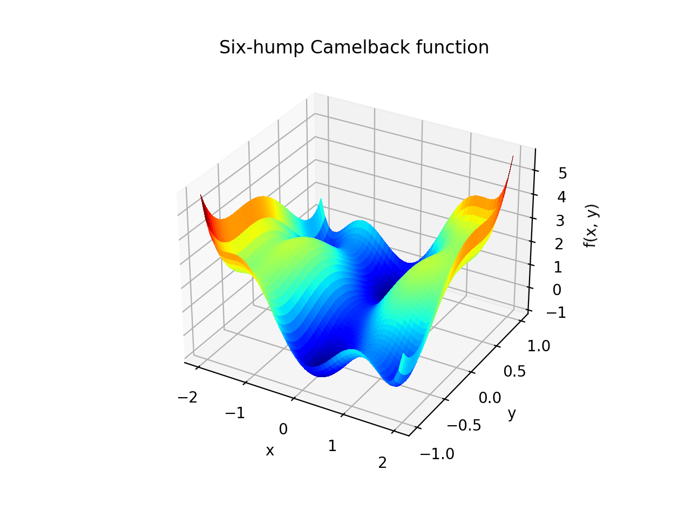
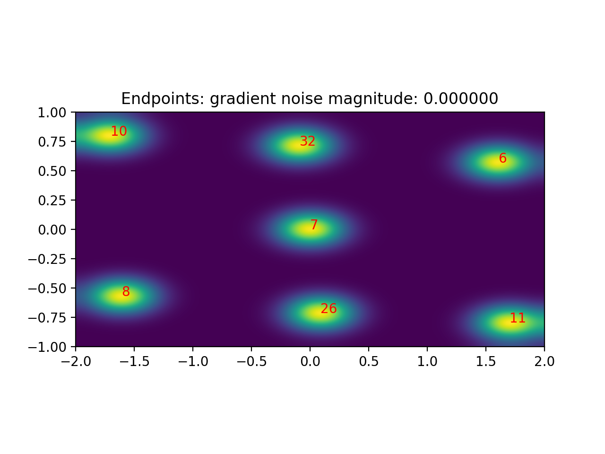
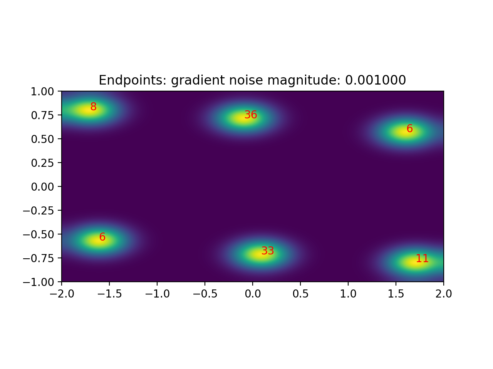

# Simple implementation of L-BFGS (low-memory)

Following the description on [Wikipedia](https://en.wikipedia.org/wiki/Limited-memory_BFGS), reproduced here for completeness:

## Results

We try it on the six-hump camelback function:

Some sample trajectories during optimization, starting from uniformly sampled points:

The endpoint distribution is (counts indicate number of trajectories that end at that location from 100 trajectories):

Most points have converged to one of the local minima, but others are stuck at saddle points, in particular at `(0,0)`.

## Noisy gradients to move away from local maxima

We can add some Gaussian noise to the gradients (as is common in machine learning due to the use of a small batch size) to move away from the local maxima:

