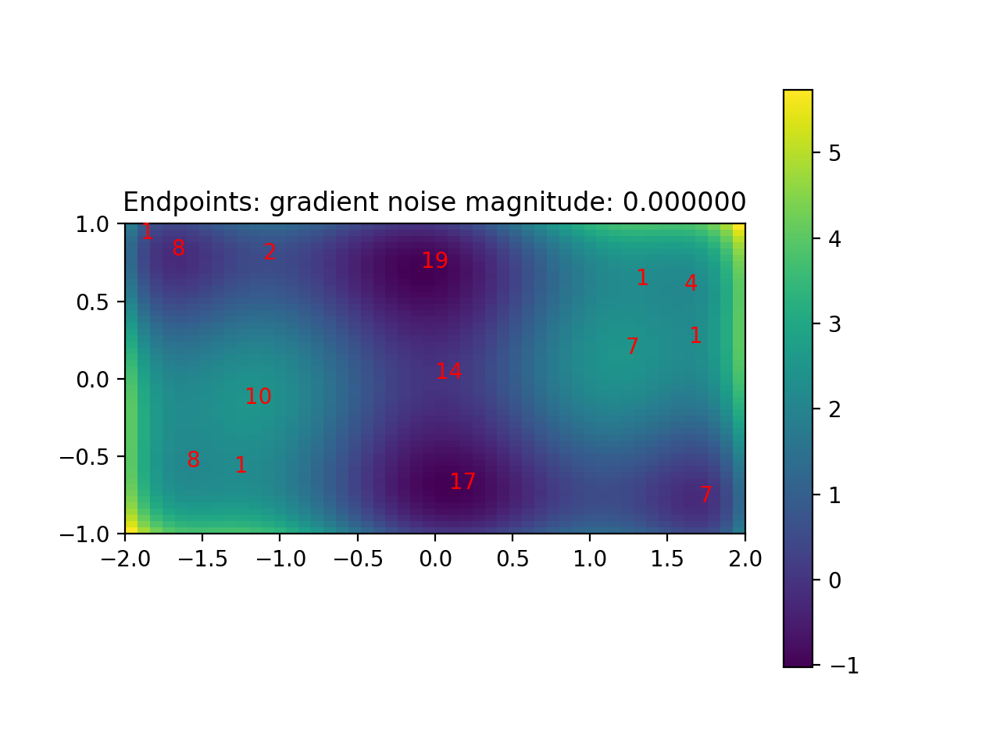
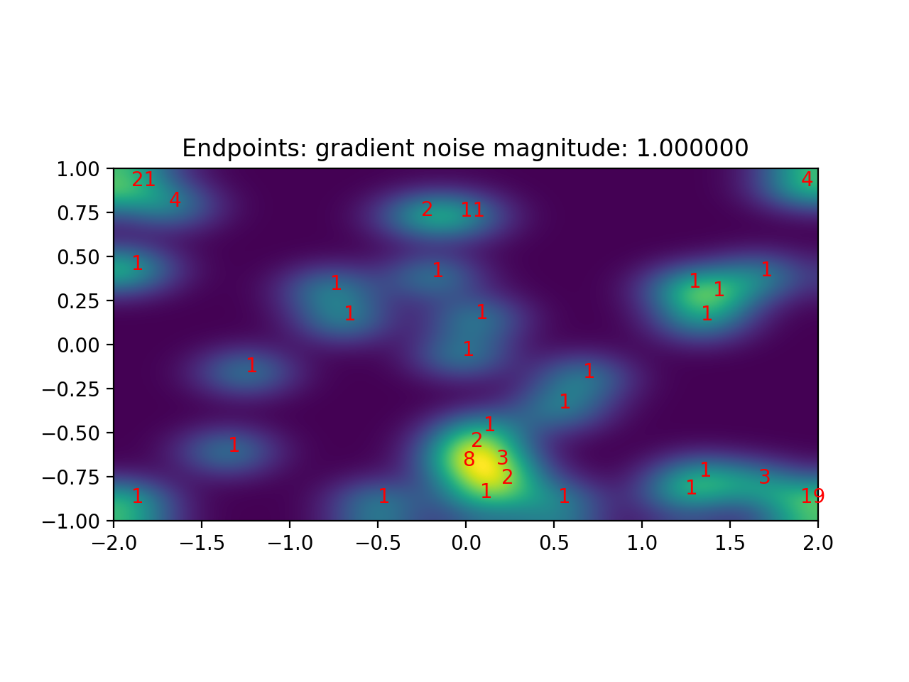
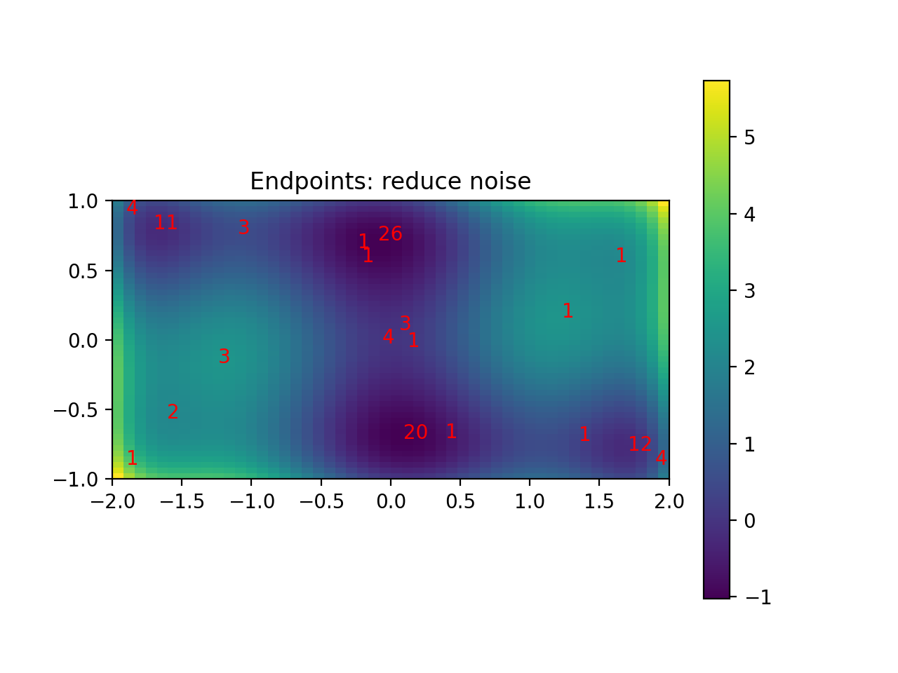
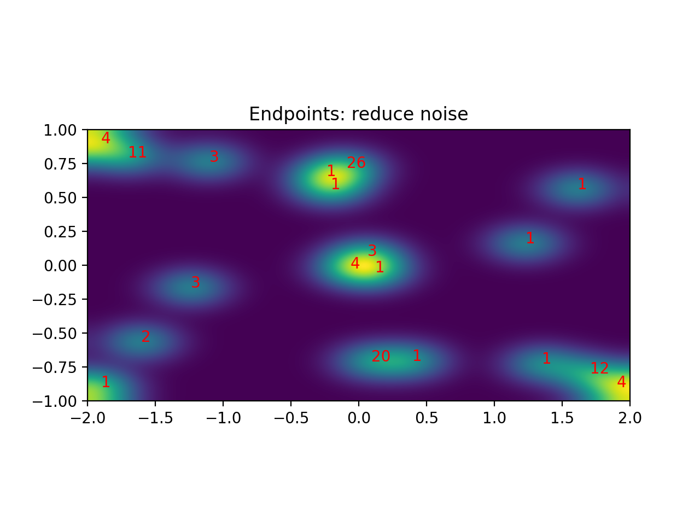

# Simple implementation of L-BFGS (low-memory)

Following the description on [Wikipedia](https://en.wikipedia.org/wiki/Limited-memory_BFGS), reproduced here for completeness:

## Results

We try it on the six-hump camelback function:

Some sample trajectories during optimization, starting from uniformly sampled points:

The endpoint distribution is (counts indicate number of trajectories that end at that location from 100 trajectories):

We can see that while some points converged to one of the local minima, others are stuck at saddle points (e.g. 14 in the middle). A more serious point, however, is that some are stuck at the local maxima, e.g. 10 on the bottom left and 7 on the top right.

## Noisy gradients to move away from local maxima

We can add some Gaussian noise to the gradients (as is common in machine learning due to the use of a small batch size) to move away from the local maxima:

We've certainly moved off the local maxima a bit, but we're also scattered all over.

## Dialing in the noise

We can get the best of both worlds by dividing the optimization into a "high noise" and a "low noise" regime, i.e. we reduce the noise at the end. The initial standard deviation of the noise in the gradients is 1 for 500 optimization steps; the second part is done with noise 0.1 for 25 optimization steps. The ML equivalent would be to increase the batch size, reducing the noise in the gradients for a few costlier steps.

